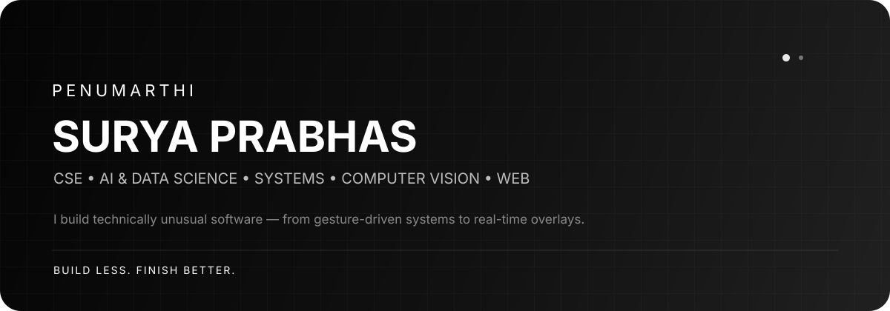

<div align="center">



<br/>

<a href="https://suryaprabhas.in/"></a>
<a href="https://github.com/suryaprabhaz"></a>
<a href="https://www.linkedin.com/in/suryaprabhaz"></a>

</div>

## About

I'm **Phanindra Surya Prabhas**, a Computer Science student specializing in **AI & Data Science**.

I like building projects where the engineering is visible beneath the interface: real-time interaction, computer vision, networking, Windows internals, API-driven applications, and polished web experiences.

> **My rule:** a smaller set of finished, explainable projects beats a large collection of abandoned demos.

---

## Selected work

<table>
<tr>
<td width="50%" valign="top">

### Gesture Drop
**Computer Vision · Networking · Python**

A gesture-driven desktop → mobile transfer system.

- Hand-gesture interaction
- Local Flask transport
- Input validation
- Automated API tests
- Security-aware network model

<a href="https://github.com/suryaprabhaz/gesture-drop">View repository →</a>

</td>
<td width="50%" valign="top">

### SuryaHUD
**C# · .NET 8 · Win32 · Direct3D**

A lightweight Windows FPS/system overlay.

- Real-time frame monitoring
- Direct3D/Direct2D rendering
- Ping monitoring
- WPF settings UI
- Automated tests + Windows CI

<a href="https://github.com/suryaprabhaz/fps-overlay">View repository →</a>

</td>
</tr>
<tr>
<td width="50%" valign="top">

### ₹2 Smile Machine
**Three.js · GSAP · Canvas**

An interactive nostalgia experience inspired by old Indian railway-station coin machines.

- Procedural 3D machine
- Interactive ticket generation
- Procedural audio
- Mobile safeguards
- Reduced-motion support

<a href="https://github.com/suryaprabhaz/nostalgia-machine">View repository →</a>

</td>
<td width="50%" valign="top">

### FlixOrbit
**JavaScript · TMDB · UI Engineering**

A responsive movie discovery experience.

- Search + discovery
- Movie details
- Cast + trailers
- Streaming availability
- Watchlist + keyboard UX

<a href="https://github.com/suryaprabhaz/flixorbit">View repository →</a>

</td>
</tr>
</table>

---

## What I build

```text
                    ┌──────────────────────────────┐
                    │        SURYA PRABHAS        │
                    └──────────────┬───────────────┘
                                   │
          ┌────────────────────────┼────────────────────────┐
          │                        │                        │
     SYSTEMS                  INTELLIGENCE                WEB
          │                        │                        │
   Win32 / .NET             Computer Vision          JavaScript / TS
   Rendering                Real-time inference       APIs / UI
   Performance              HCI / interaction        Responsive UX
          │                        │                        │
          └────────────────────────┼────────────────────────┘
                                   │
                           PRODUCTION HYGIENE
                                   │
                    tests • CI • security • docs
```

---

## Tech stack

<div align="center">

**Languages**


**Engineering**


</div>

---

## Engineering principles

| Principle | What it means |
|---|---|
| **Ship evidence** | Demos, tests, benchmarks and reproducible builds matter more than claims. |
| **Keep the UI honest** | A simulation should say simulation. A prototype should say prototype. |
| **Design for failure** | Network errors, invalid input and missing permissions are normal states. |
| **Make projects explainable** | A recruiter should understand the problem, architecture and trade-offs quickly. |
| **Finish the interesting parts** | Depth beats repository count. |

---

## Current direction

I'm focusing on becoming the kind of engineer who can take an idea from:

**concept → architecture → implementation → testing → deployment → polished demo**

The goal isn't to collect technologies.

The goal is to build software that is **interesting enough to remember and engineered well enough to trust.**

---

## Beyond the repositories

**Portfolio:** [suryaprabhas.in](https://suryaprabhas.in/)  
**GitHub:** [@suryaprabhaz](https://github.com/suryaprabhaz)  
**LinkedIn:** [linkedin.com/in/suryaprabhaz](https://www.linkedin.com/in/suryaprabhaz)

<div align="center">

### Thanks for stopping by.

<sub>Built with curiosity, caffeine, and an unreasonable amount of iteration.</sub>

</div>
